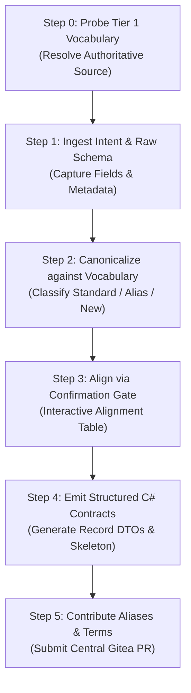

# MCP Tool DTO Builder

Transform legacy parameters and raw API schemas into strongly-typed, immutable C# DTO contracts for MCP Tools. Dynamically resolves authoritative Tier 1 domain vocabulary (`Tier1Vocabulary.cs`) from the local workspace or a remote Gitea repository, and optionally submits newly discovered aliases or terms to the central repository via PR.

---

## Workflow Sequence

---

### Step 0: Probe Tier 1 Vocabulary Source

Dynamically resolve the authoritative `Tier1Vocabulary.cs` using the 2-tier probe strategy:

1. **Local Probe (Tier 1A)**:
   - Scan workspace for `**/Tier1Vocabulary.cs` or `**/CoreGlossary.cs`.
   - Inspect `.csproj` / `.sln` / `Directory.Build.props` project references (`<ProjectReference Include="...McpGateway.Analyzers..." />`) and resolve target paths.
   - If found, read directly and extract all `GlossaryEntry` definitions into context.
2. **Remote Probe (Tier 1B)**:
   - If local search fails, inspect `<PackageReference Include="McpGateway.Analyzers" Version="..." />` for the release tag.
   - Fetch `Tier1Vocabulary.cs` via Git / `tea` CLI into `.scratch/tier1-vocab/` and parse definitions.
   - Fallback: Prompt developer for the local file path or Gitea repository URL.

> See [WORKFLOW.md](WORKFLOW.md#2-step-0-動態解析-tier-1-詞庫探測機制-tier-1-vocabulary-probe-strategy) for detailed probe algorithms, fallback sequences, and repository configuration.

**Observability Output**:
State the resolved source in conversation:
> `✅ 已從 <來源名稱> (版本/分支: <Tag/Branch>) 載入 N 個 Tier 1 標準詞彙與 M 個歷史別名。`

> **Completion Criterion**: Authoritative Tier 1 vocabulary entries are loaded into context and reported to the developer.

---

### Step 1: Ingest Intent & Raw Schema

Capture the tool's business context and raw field specifications:

1. **Tool Purpose**: What business capability does this tool provide to AI agents?
2. **Input Parameters**: Required and optional filter/query parameters with initial data types.
3. **Output Structure**: Existing JSON response, SQL query result, legacy DTO, or list of fields.
4. **Target Department / Gateway**: (e.g., Report, MES, EAP, SPC, QC) to determine local Tier 2 `mcp-glossary.json` scope.

> **Completion Criterion**: Tool business purpose is clearly stated, and the raw list of all input and output fields with initial types/meanings is captured.

---

### Step 2: Canonicalize against Vocabulary

Analyze 100% of captured fields against the resolved Tier 1 vocabulary and project-level `mcp-glossary.json`:

Categorize every field into one of three buckets:
1. **Tier 1 Standard Hit**: Exact match with standard term (e.g., `productId`, `eqptId`, `workCenter`, `quantityInProcess`, `status`).
2. **Tier 1 Alias Match (Correction Required)**: Matches a known legacy alias (e.g., `productCode` -> `productId`, `machNo` -> `eqptId`, `wipQty` -> `quantityInProcess`, `wo` -> `workOrderId`). Flag with correction recommendation (`MCP0010`).
3. **Domain-Specific / New Term**: Field does not exist in Tier 1. Formulate a compliant `camelCase`/`PascalCase` name without underscores (`MCP0012`) and craft a precise Traditional Chinese description.

> **Completion Criterion**: 100% of input and output fields are classified into the three buckets, with proposed standard names, nullability, types, and descriptions prepared in a structured comparison table.

---

### Step 3: Align via Confirmation Gate

Present the Field Alignment Table to the developer for explicit confirmation before generating code:

| 原始欄位 (Raw Field) | 建議標準名稱 (C# / JSON) | 來源分類 (Category) | 建議 C# 型別 | 建議繁體中文說明 (`[Description]`) | 備註 / 決策理由 |
| :--- | :--- | :--- | :--- | :--- | :--- |
| `prod_id` | `ProductId` / `productId` | ⚠️ Tier 1 別名校正 | `string` | 產品料號或唯一代碼 (Product ID) | 校正已知別名 (MCP0010) |
| `wip_qty` | `QuantityInProcess` / `quantityInProcess` | ⚠️ Tier 1 別名校正 | `int` | 目前在製中數量（尚未完工） | 校正已知別名 (MCP0010) |
| `remark` | `Remark` / `remark` | 💡 專案自定義 | `string?` | 額外備註或特殊注意事項說明 | 非 Tier 1，採駝峰規範 |

Highlight:
- Corrections from legacy aliases (`MCP0010`).
- Nullability decisions (`?` for optional inputs or nullable outputs).
- Nested sub-DTOs (e.g., separating list items into `<Entity>ItemDto` and summary metrics into `<Entity>SummaryDto`).

> **Completion Criterion**: Developer confirms the field mappings, types, and descriptions, or provides explicit override instructions.

---

### Step 4: Emit Structured C# Contracts

Generate complete, production-ready C# code:

1. **Input DTO**: `public sealed record <ToolName>Input(...)` with `[property: Description("...")]` on every parameter.
2. **Output DTO**: `public sealed record <ToolName>Response(...)` (or structured root DTO) with `[property: Description("...")]` on every property.
3. **Nested DTOs**: Create dedicated records for collection items (e.g., `<Entity>ItemDto`) and nested objects, ensuring every nested property has its own `[property: Description]`.
4. **Tool Class Method Skeleton**: `[McpServerToolType]` class containing `[McpServerTool(UseStructuredContent = true)]` method signature.
5. **Tier 2 Proposal (Optional)**: If new domain-specific terms are identified that should be shared across the department, output a sample snippet for `mcp-glossary.json`.

> Strictly adhere to [CONTRACT_RULES.md](CONTRACT_RULES.md) for immutable positional record syntax, Description attributes, and Roslyn MCP0010-MCP0012 compliance.

> **Completion Criterion**: Output C# code is fully typed, compiles without Roslyn `MCP0010`, `MCP0011`, or `MCP0012` warnings, and exposes complete metadata for AI agent structured reasoning.

---

### Step 5: Contribute Aliases & Terms via Central PR

When Step 2/3 identifies new aliases for existing Tier 1 terms or candidate new standard terms, proactively assist the developer in contributing back to the authoritative repository:

1. **Trigger & Scope**:
   - **New Aliases**: Add discovered legacy alias names to the `Aliases` array of the corresponding `GlossaryEntry`.
   - **New Standard Terms**: Propose a new `GlossaryEntry` for cross-department standard terms.
2. **Pre-flight Validation**:
   - Perform case-insensitive collision checks to ensure proposed aliases do not conflict with existing standard terms or aliases in `Tier1Vocabulary.cs`.
3. **Preview & Confirmation**:
   - Present a clear C# diff preview for `Tier1Vocabulary.cs`.
   - Provide a formatted PR summary table (Source Gateway/Department, Raw Field, Target Standard Term, Business Rationale).
   - Prompt the developer for explicit approval before executing Git or PR commands.
4. **Environment-Aware Execution**:
   - **Central Repo (`McpGateway.Core`)**: Create local branch `vocab/<term>-alias`, update `src/McpGateway.Analyzers/Tier1Vocabulary.cs`, commit, push to remote Gitea, and execute `tea pr create`.
   - **Downstream Gateway Project**: Use `tea` CLI / Gitea API against upstream `guy.mai/McpGateway.Core` repository to create the branch and submit the PR.

> See [WORKFLOW.md](WORKFLOW.md#7-step-5-詞庫擴充與中央-pr-自動提報機制-tier-1-vocabulary-contribution--pr-mechanism) for CLI commands, branch naming conventions, and PR review templates.

> **Completion Criterion**: Pull request is created on the central Gitea repository with a structured review table, and the clickable PR URL is returned to the developer.
