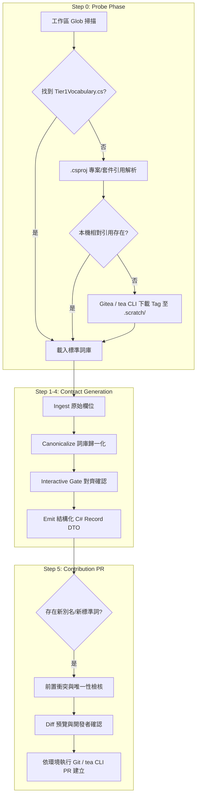

# MCP Tool DTO Builder — 技術規格與自動化手冊 (Technical Specification & Reference)

本文件作為 `mcp-tool-dto-builder` Skill 的深度技術規格文件，記載 Step 0 詞庫探測演算法、Roslyn 診斷碼規則、以及 Step 5 中央 Gitea PR 自動化提報機制。

---

## 1. 架構與生命週期總覽 (Architecture Overview)



---

## 2. Step 0: 動態解析 Tier 1 詞庫探測機制 (Probe Strategy)

為確保 AI Agent 取得最新且權威的製造業核心詞彙，採用雙層動態探測策略（2-Tier Probe Strategy）：

### 2.1 探測優先順序 (Probe Priority)

| 優先級 | 探測階段 | 目標路徑 / 搜尋樣式 | 說明 |
| :--- | :--- | :--- | :--- |
| **P1** | 工作區 Glob | `**/Tier1Vocabulary.cs`<br/>`**/CoreGlossary.cs` | 搜尋本機工作區原始碼（適用於 Central Core 開發環境） |
| **P2** | ProjectReference 解析 | `.csproj` / `.sln` 中 `<ProjectReference Include="..." />` | 解析跨專案相對路徑上游原始碼 |
| **P3** | PackageReference 版號對照 | `<PackageReference Include="McpGateway.Analyzers" Version="vX.Y.Z" />` | 取得 NuGet/Gitea Package Tag 版本 |
| **P4** | Gitea 遠端下載 | `mcp-glossary.json` `repositoryUrl` 或 Gitea 預設庫 | 使用 `tea` CLI / Git 擷取至 `.scratch/tier1-vocab/` |
| **P5** | 終端提示 (Fallback) | Prompt Developer | 提示開發者提供本機路徑或 Gitea URL |

### 2.2 Gitea CLI (`tea`) 下載指令範例
```powershell
# 建立暫存目錄
if (-not (Test-Path ".scratch\tier1-vocab")) { New-Item -ItemType Directory -Path ".scratch\tier1-vocab" -Force }

# 擷取特定 Tag 之 Tier1Vocabulary.cs
tea repo clone guy.mai/McpGateway.Core .scratch/tier1-vocab/repo --branch <VersionTag>
Copy-Item ".scratch\tier1-vocab\repo\src\McpGateway.Analyzers\Tier1Vocabulary.cs" ".scratch\tier1-vocab\Tier1Vocabulary.cs"
```

---

## 3. 詞庫比對與 Roslyn 診斷碼對照 (Diagnostics Reference)

在 Step 2 進行詞彙歸一化與 Step 4 產出 DTO 時，遵循以下 Roslyn Analyzer 規則：

| 診斷代碼 | 嚴重性 | 觸發條件 | 修正行為 |
| :--- | :--- | :--- | :--- |
| **`MCP0010`** | Warning | 使用了已知歷史別名（如 `ProductCode`, `prodId`, `wipQty`） | 建議更換為標準名稱（如 `ProductId`, `QuantityInProcess`） |
| **`MCP0011`** | Warning | DTO 公開屬性遺漏 `[Description]` 特性 | 補齊繁體中文業務描述與格式範例 |
| **`MCP0012`** | Info | 屬性或參數包含底線（如 `PROD_ID`, `work_order`） | 調整為標準 CamelCase / PascalCase |

---

## 4. Step 5: 詞庫擴充與中央 PR 自動提報機制 (PR Automation)

### 4.1 提報分類與程式碼異動規則
* **情境 1：新增既有詞彙之別名 (New Aliases)**
  修改 `Tier1Vocabulary.Entries` 中對應之 `GlossaryEntry`：
  ```csharp
  // 修改前
  new GlossaryEntry("productId", "ProductId", "產品料號或唯一代碼 (Product ID)", new[] { "productCode", "prodId" }),
  // 修改後（追加新別名）
  new GlossaryEntry("productId", "ProductId", "產品料號或唯一代碼 (Product ID)", new[] { "productCode", "prodId", "partNo", "materialNo" }),
  ```

* **情境 2：新增全域通用核心詞 (New Standard Entry)**
  向 `Tier1Vocabulary.Entries` 陣列末端追加新項目：
  ```csharp
  new GlossaryEntry("<standardCamel>", "<StandardPascal>", "<繁體中文說明>", new[] { "<alias1>", "<alias2>" }),
  ```

### 4.2 前置防呆與衝突檢核演算法
在建立分支與 PR 前，執行以下自動驗證：
1. **別名唯一性檢核 (Alias Collision Check)**：遍歷現有 `Tier1Vocabulary.Entries`，確認提報之別名未以任何大小寫形式出現在其他詞條的 `StandardCamel`、`StandardPascal` 或 `Aliases` 中。
2. **格式檢核**：確認標準名稱不含底線與特殊符號，別名不包含前後空白。

### 4.3 環境感知執行命令

#### 情境 A：當前工作區為中央 Core 專案 (`McpGateway.Core`)
```powershell
git checkout -b vocab/<term>-alias
# 套用 Tier1Vocabulary.cs 異動
git add src/McpGateway.Analyzers/Tier1Vocabulary.cs
git commit -m "feat(vocab): add aliases for <ToolName>"
git push gitea vocab/<term>-alias
tea pr create --title "feat(vocab): add aliases for <ToolName>" --description "<PR_ALIGNMENT_TABLE>"
```

#### 情境 B：當前工作區為下游 Gateway 專案
```powershell
# 透過 tea CLI 對遠端中央 Repository 建立 PR
tea pr create --repo guy.mai/McpGateway.Core --title "feat(vocab): add aliases from <GatewayName>" --description "<PR_ALIGNMENT_TABLE>"
```

---

## 5. PR 結構化審核對齊表範本 (PR Markdown Template)

發送至中央團隊審核之 PR Description 格式：

```markdown
## 業務背景與提報來源
- **來源部門 / Gateway**: `MES` (或 `Report`, `EAP`, `SPC`, `QC`)
- **相關工具 / DTO**: `QueryWipTool` (`WipItemDto`)

## 詞庫異動對齊表
| 原始欄位 (Raw Field) | 提報類型 | 目標標準詞 (Standard Term) | 繁體中文說明 | 提報與審核理由 |
| :--- | :--- | :--- | :--- | :--- |
| `part_no` | 擴充別名 | `productId` | 產品料號或唯一代碼 | MES 歷史資料庫欄位別名收錄 |
| `fixtureId` | 全新核心詞 | `fixtureId` | 治具/夾具識別碼 | 治具管理跨 Gateway 共用概念 |

## 檢核狀態
- [x] 通過別名衝突檢核 (No alias collisions found)
- [x] 符合 CamelCase / PascalCase 命名規範
```

