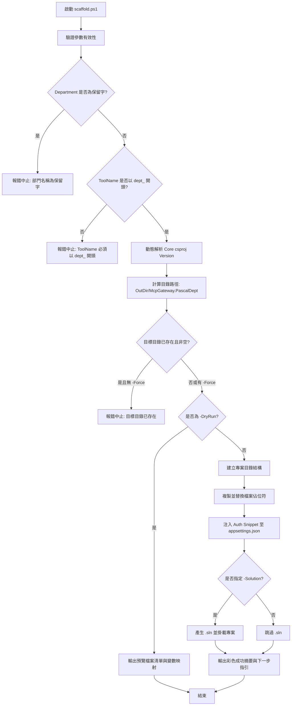

# MCP Gateway 部門專案腳手架 (Scaffold) 標準化設計規格書

- **文件編號**：SPEC-SCAFFOLD-001
- **狀態**：Approved / Ready for Implementation
- **建立日期**：2026-08-31
- **歸屬專案**：`McpGateway.Core`
- **交付目標**：提供 `McpGateway.Core/templates/scaffold.ps1` 與模板樹的完整實作規格

---

## 1. 概述與範圍邊界 (Destination & Scope)

### 1.1 背景與目的
為加速半導體/面板製造現場各部門（如 EAP、SPC、EDC、報表等）快速建立符合公司架構標準的獨立 MCP Gateway 服務，開發自動化腳手架腳本 `scaffold.ps1`。
該腳手架消除各部門自行命名與架構設計的隨機性，產出開箱即用（Out-of-the-Box）、具備企業級認證、健康檢查、指標遙測、快取與 Roslyn 靜態檢核之標準 C# .NET 9 專案。

### 1.2 範圍界定
- **In-Scope（本規格規範）**：
  1. `McpGateway.Core/templates/` 模板樹目錄結構與完整檔案清單。
  2. 雙底線佔位符 (`__Placeholder__`) 與 Auth Snippet 片段注入機制。
  3. 部門命名、通訊埠分配、Tool Name 前綴與保留字檢核規則。
  4. Auth、Consul、下游 API Options、MemoryCache、端點 YAML 與 NuGet 參考策略。
  5. `scaffold.ps1` 命令列介面契約、參數驗證、目錄衝突防護、執行輸出與錯誤處理。
  6. 完整端到端產生範例與驗收標準。
- **Out-of-Scope（不在本階段處理）**：
  1. `dotnet new` NuGet 模板套件打包與發佈。
  2. 跨 Gateway 分散式快取與資料聚合（Data Mesh）。
  3. 各部門專案內部特定的業務邏輯實作。

---

## 2. 模板目錄結構與檔案清單

### 2.1 模板源碼於 Core Repo 之存放位置
所有腳手架資產存放於 `McpGateway.Core` 專案下：
```
McpGateway.Core/
└── templates/
    ├── scaffold.ps1                     # 腳手架主要產生腳本
    ├── ports.md                         # 跨部門 Port 分配對照登記表
    ├── snippets/                        # 條件片段檔案庫
    │   └── auth/
    │       ├── api-key.json             # UAC API-KEY 認證區段
    │       ├── jwt.json                 # JWT/JWKS 認證區段
    │       ├── ntlm.json                # NTLM 認證區段
    │       └── none.json                # 關閉認證區段
    └── template/                        # 專案模板樹 (含佔位符)
        ├── .vscode/
        │   ├── launch.json
        │   └── tasks.json
        ├── Configuration/
        │   └── __OptionsClass__.cs
        ├── Exceptions/
        │   ├── .gitkeep
        │   └── ShopNotFoundException.cs
        ├── Models/
        │   ├── .gitkeep
        │   ├── ConsulShopItem.cs
        │   └── ResolvedShopConfig.cs
        ├── Properties/
        │   └── launchSettings.json
        ├── Services/
        │   ├── IShopConfigResolver.cs
        │   ├── ConsulShopConfigResolver.cs
        │   ├── I__ToolClass__Service.cs
        │   └── __ToolClass__Service.cs
        ├── Tools/
        │   ├── Test/
        │   │   └── HelloTool.cs
        │   └── __ToolClass__/
        │       └── __ToolClass__Tool.cs
        ├── docs/
        │   └── mcp-glossary.schema.json
        ├── .gitignore
        ├── appsettings.json
        ├── appsettings.Development.json
        ├── __department__-endpoints.yaml
        ├── mcp-glossary.json
        ├── MCP_ENDPOINTS.md
        ├── McpGateway.__Department__.csproj
        ├── nuget.config
        ├── Program.cs
        └── README.md
```

### 2.2 檔案產生決策清單
| 檔案 / 目錄 | 處理方式 | 說明 |
|---|---|---|
| `McpGateway.__Department__.csproj` | 產生 (參數化) | 引用 `McpGateway.Core` 與 `McpGateway.Analyzers` |
| `Program.cs` | 產生 (參數化) | 註冊 `AddMcpGateway()`、`MapMcpGateway()`、`ConsulShopConfigResolver`、`WithTools<T>()` |
| `appsettings.json` | 產生 (參數化) | 注入 Auth Snippet、Department (小寫)、RoutePrefix (`/mcp`)、Downstream Options |
| `appsettings.Development.json` | 產生 (固定) | 開發環境 LogLevel 設定 |
| `nuget.config` | 產生 (固定) | 設定公司 BaGet 私有 feed (`http://10.53.216.186:5000/v3/index.json`) 與 nuget.org |
| `__department__-endpoints.yaml` | 產生 (最小骨架) | 僅提供基本說明註解與空骨架 |
| `Properties/launchSettings.json` | 產生 (參數化) | `applicationUrl` 綁定 `http://localhost:__Port__` |
| `.gitignore` | 產生 (參數化) | 包含 `!__department__-endpoints*.yaml` 白名單 |
| `Tools/__ToolClass__/__ToolClass__Tool.cs` | 產生 (參數化) | 包含 Input DTO、Output DTO、`[McpServerTool(Name = "__tool_name__", UseStructuredContent = true)]` |
| `Tools/Test/HelloTool.cs` | 產生 (固定) | 提供開箱即用之 smoke test 連線驗證工具 |
| `Services/I__ToolClass__Service.cs` | 產生 (參數化) | 下游服務抽象介面 |
| `Services/__ToolClass__Service.cs` | 產生 (參數化) | 包含下游 HTTP 呼叫 + `IMemoryCache` 快取實作範例 |
| `Services/IShopConfigResolver.cs` | 產生 (固定) | 廠別解析層介面 |
| `Services/ConsulShopConfigResolver.cs` | 產生 (固定) | Consul 廠別解析與本地 fallback 實作 |
| `Models/ConsulShopItem.cs` | 產生 (固定) | Consul K/V 結構 Model |
| `Models/ResolvedShopConfig.cs` | 產生 (固定) | 解析後廠別端點 Model |
| `Exceptions/ShopNotFoundException.cs` | 產生 (固定) | 廠別未找到異常型別 |
| `Configuration/__OptionsClass__.cs` | 產生 (參數化) | 下游業務設定段 Options |
| `mcp-glossary.json` | 產生 (固定) | Tier 2 詞彙庫空骨架 (`"terms": []`) |
| `docs/mcp-glossary.schema.json` | 產生 (固定) | 詞彙庫 JSON Schema |
| `README.md` / `MCP_ENDPOINTS.md` | 產生 (參數化) | 專案說明與端口/路由文件 |
| `.vscode/launch.json` & `tasks.json` | 產生 (參數化) | VS Code 除錯與建置設定 (綁定 csproj) |

---

## 3. 佔位符與片段替換引擎 (Placeholder & Snippets)

### 3.1 佔位符對照表
腳本使用正規表達式 `__[A-Za-z0-9_]+__` 掃描模板檔案並替換：

| 佔位符 | 說明 | 來源 / 運算規則 | 範例 |
|---|---|---|---|
| `__Department__` | 部門 PascalCase | 依 `-Department` 轉 PascalCase | `Eap`, `MfgReport` |
| `__department__` | 部門全小寫 | 依 `-Department` 轉 lowercase | `eap`, `mfg_report` |
| `__Port__` | 服務監聽連接埠 | 直接取自 `-Port` | `5200` |
| `__ToolClass__` | 工具 Class 名稱 (PascalCase) | 依 `-ToolName` 去除前綴後轉 PascalCase | `QueryLot` |
| `__tool_name__` | MCP 工具名稱 (snake_case) | 直接取自 `-ToolName` (含部門前綴) | `eap_query_lot` |
| `__OptionsClass__` | 業務設定類別名稱 | `__ToolClass__Options` (或 `__Department__Options`) | `QueryLotOptions` |
| `__Namespace__` | 根命名空間 | `McpGateway.__Department__` | `McpGateway.Eap` |
| `__CoreVersion__` | McpGateway.Core 版本 | 動態解析 `McpGateway.Core.csproj` 的 `<Version>` | `0.2.0-preview` |
| `__AuthSection__` | 認證區段 JSON | 由 `templates/snippets/auth/<provider>.json` 整段注入 | 詳見 3.2 |

### 3.2 Auth Snippets 定義 (`templates/snippets/auth/`)
- **`api-key.json`**：
  ```json
  "Auth": {
    "Provider": "API-KEY",
    "Enabled": true,
    "SystemName": "mcp-__department__",
    "ConsulKey": "ApiUrls.ProductionOa",
    "FallbackUacApiUrls": [
      "http://hp08239p.cminl.oa/uacapitest"
    ],
    "ApiKeyTimeoutSeconds": 3,
    "CacheTtlMinutes": 30
  }
  ```
- **`jwt.json`**：
  ```json
  "Auth": {
    "Provider": "JWT",
    "Enabled": true,
    "JwksEndpoint": "http://identity.corp.local/.well-known/jwks.json",
    "JwksCacheHours": 24
  }
  ```
- **`ntlm.json`**：
  ```json
  "Auth": {
    "Provider": "NTLM",
    "Enabled": true
  }
  ```
- **`none.json`**：
  ```json
  "Auth": {
    "Provider": "None",
    "Enabled": false
  }
  ```

---

## 4. 命名規範與 Port 分配機制

### 4.1 Department 命名映射規則
- **專案名稱**：`McpGateway.<PascalDept>`（如 `McpGateway.Eap`）。
- **RootNamespace**：`McpGateway.<PascalDept>`。
- **Git Repo 名稱**：`McpGateway.<PascalDept>`（1:1 一致，不加額外後綴）。
- **`appsettings.json` 的 `Department`**：全小寫（如 `"eap"`）。
- **`appsettings.json` 的 `RoutePrefix`**：預設固定為 `"/mcp"`。

### 4.2 Port 分配策略 (`templates/ports.md`)
在 Core 維護靜態分配表，供架構團隊查閱與登記：
```markdown
# MCP Gateway Port 分配清單

| 部門 / 服務 | Port | 狀態 | 備註 |
|---|---|---|---|
| BaGet NuGet Feed | 5000 | 運作中 | 內部套件庫 |
| MockOcelotApi | 5001 | 運作中 | 本地測試用下游 Mock |
| McpGateway.Report | 5100 | 運作中 | 報表部門 Gateway (參考實作) |
| McpGateway.Eap | 5200 | 預留 | EAP 設備自動化部門 |
| McpGateway.Spc | 5300 | 預留 | SPC 統計製程管制部門 |
| McpGateway.Edc | 5400 | 預留 | EDC 工程資料收集部門 |
| McpGateway.Qc | 5500 | 預留 | QC 品保部門 |
```

### 4.3 Tool 命名與前綴檢核
- **規範**：MCP Tool Name 必須符合全小寫 `snake_case`，且**必須強制以 `<department>_` 開頭**（例如 `eap_query_lot`、`report_query_wip`）。
- **理由**：嚴格符合 ADR-009 D6，Core `ToolStartupValidator` 啟動時會檢查前綴並 fail-fast，避免 Agent 掛載多 Gateway 時產生同名工具靜默呼叫錯誤。
- **腳本驗證**：若 `-ToolName` 未以 `<department>_` 開頭，腳本直接報錯中止。

### 4.4 Department 值域與保留字
- **值域**：正規表達式 `^[a-zA-Z][a-zA-Z0-9_]*$`，長度 2–20 字元。
- **保留字**（不區分大小寫）：`core`, `common`, `shared`, `test`, `tests`, `gateway`, `base`, `mock`, `mcp`, `template`。

---

## 5. 設定策略 (Configuration Policy)

### 5.1 NuGet 參考與 Feed 設定
- **獨立 `nuget.config`**：
  ```xml
  <?xml version="1.0" encoding="utf-8"?>
  <configuration>
    <packageSources>
      <clear />
      <add key="nuget.org" value="https://api.nuget.org/v3/index.json" protocolVersion="3" />
      <add key="baget-local" value="http://10.53.216.186:5000/v3/index.json" />
    </packageSources>
  </configuration>
  ```
- **`csproj` 參考定義**：
  ```xml
  <ItemGroup>
    <PackageReference Include="McpGateway.Core" Version="__CoreVersion__" />
    <PackageReference Include="McpGateway.Analyzers" Version="__CoreVersion__" PrivateAssets="all" />
  </ItemGroup>
  ```

### 5.2 Consul 與 FallbackShops 設定形態
- **程式碼保持不變**：無論 `-UseConsul` 為 true 或 false，`Program.cs` 皆註冊 `ConsulShopConfigResolver`。
- **設定差異**：
  - `-UseConsul true`：
    ```json
    "Consul": { "Urls": [ "http://tncimweb1.cminl.oa:8500/", "http://tncimweb2.cminl.oa:8500/" ] }
    ```
  - `-UseConsul false`：
    ```json
    "Consul": { "Urls": [] }
    ```
    業務 Options 區段啟用 `FallbackShops` 清單，由 Resolver 本地解析。

### 5.3 下游 API Options 類別骨架
```csharp
namespace McpGateway.__Department__.Configuration;

public class __OptionsClass__
{
    public string BaseUrl { get; set; } = "http://api.corp.local/__department__";
    public int TimeoutSeconds { get; set; } = 30;
    public int CacheMinutes { get; set; } = 3;
    public List<string> ConsulUrls { get; set; } = new();
    public string ConsulKey { get; set; } = "__Department__ShopList";
    public Dictionary<string, string> FallbackShops { get; set; } = new()
    {
        { "TFT1", "http://tft1-api.corp.local/__department__" }
    };
}
```

---

## 6. `scaffold.ps1` 腳本介面規格

### 6.1 參數清單 (Parameter Matrix)
```powershell
[CmdletBinding()]
param (
    [Parameter(Mandatory = $true, HelpMessage = "部門名稱代號 (如 eap, spc, mfg_report)")]
    [ValidatePattern('^[a-zA-Z][a-zA-Z0-9_]*$')]
    [string]$Department,

    [Parameter(Mandatory = $true, HelpMessage = "服務監聽通訊埠 (如 5200)")]
    [ValidateRange(1024, 65535)]
    [int]$Port,

    [Parameter(Mandatory = $true, HelpMessage = "主要 MCP 工具名稱 (必須以 <department>_ 開頭，如 eap_query_lot)")]
    [ValidatePattern('^[a-z0-9_]+$')]
    [string]$ToolName,

    [Parameter(Mandatory = $false, HelpMessage = "認證提供者")]
    [ValidateSet('API-KEY', 'JWT', 'NTLM', 'None')]
    [string]$AuthProvider = 'API-KEY',

    [Parameter(Mandatory = $false, HelpMessage = "是否啟用 Consul 集中式服務發現設定")]
    [bool]$UseConsul = $true,

    [Parameter(Mandatory = $false, HelpMessage = "是否建立 .sln 方案檔")]
    [switch]$Solution,

    [Parameter(Mandatory = $false, HelpMessage = "輸出目錄路徑 (預設為當前目錄)")]
    [string]$OutDir = '.\',

    [Parameter(Mandatory = $false, HelpMessage = "預覽模式 (不寫入磁碟)")]
    [switch]$DryRun,

    [Parameter(Mandatory = $false, HelpMessage = "若目標目錄已存在則強制覆寫")]
    [switch]$Force
)
```

### 6.2 執行流程 (Execution Lifecycle)


### 6.3 執行後終端輸出樣式
```
================================================================================
  MCP Gateway 部門專案產生成功！
================================================================================
  專案名稱:    McpGateway.Eap
  根命名空間:  McpGateway.Eap
  通訊埠:      5200 (http://localhost:5200)
  認證方式:    API-KEY
  主要工具:    eap_query_lot
  Core 版本:   0.2.0-preview
  輸出路徑:    D:\Projects\.NET\McpGateway.Eap
================================================================================

下一步操作指引：
  1. 切換至專案目錄：
     cd D:\Projects\.NET\McpGateway.Eap

  2. 還原與驗證 NuGet 套件：
     dotnet restore

  3. 驗證編譯與 Roslyn 分析器：
     dotnet build

  4. 調整下游 API 設定：
     開啟 appsettings.json 設定 Eap 業務段之 BaseUrl 與 ConsulKey

  5. 實作業務邏輯：
     - Tools/QueryLot/QueryLotTool.cs (定義輸入/輸出 DTO)
     - Services/QueryLotService.cs (實作下游 HTTP 呼叫與快取)

  6. 啟動服務測試：
     dotnet run
     curl http://localhost:5200/mcp
```

---

## 7. 端到端產生範例 (Walkthrough Example)

### 7.1 命令
```powershell
pwsh .\McpGateway.Core\templates\scaffold.ps1 `
    -Department eap `
    -Port 5200 `
    -ToolName eap_query_lot `
    -AuthProvider API-KEY `
    -UseConsul $true `
    -OutDir D:\Projects\.NET
```

### 7.2 產生之主要核心檔案範例

#### 1. `McpGateway.Eap.csproj`
```xml
<Project Sdk="Microsoft.NET.Sdk.Web">
  <PropertyGroup>
    <TargetFramework>net9.0</TargetFramework>
    <Nullable>enable</Nullable>
    <ImplicitUsings>enable</ImplicitUsings>
    <RootNamespace>McpGateway.Eap</RootNamespace>
  </PropertyGroup>

  <ItemGroup>
    <PackageReference Include="McpGateway.Core" Version="0.2.0-preview" />
    <PackageReference Include="McpGateway.Analyzers" Version="0.2.0-preview" PrivateAssets="all" />
  </ItemGroup>
</Project>
```

#### 2. `Program.cs`
```csharp
using McpGateway.Core.Hosting;
using McpGateway.Eap.Configuration;
using McpGateway.Eap.Services;
using McpGateway.Eap.Tools.QueryLot;
using McpGateway.Eap.Tools.Test;

var builder = WebApplication.CreateBuilder(args);

// 1. 註冊 McpGateway 核心服務
builder.Services.AddMcpGateway();

// 2. 註冊業務 Options 與 Services
builder.Services.Configure<QueryLotOptions>(
    builder.Configuration.GetSection("Eap"));
builder.Services.AddHttpClient<IQueryLotService, QueryLotService>();
builder.Services.AddSingleton<IShopConfigResolver, ConsulShopConfigResolver>();

// 3. 註冊 MCP Tools
builder.Services.AddMcpServer()
    .WithTools<QueryLotTool>()
    .WithTools<HelloTool>();

var app = builder.Build();

// 4. 掛載路由與啟動
app.MapMcpGateway();
await app.RunMcpGatewayAsync();
```

#### 3. `Tools/QueryLot/QueryLotTool.cs`
```csharp
using System.ComponentModel;
using McpGateway.Eap.Services;
using ModelContextProtocol.Server;

namespace McpGateway.Eap.Tools.QueryLot;

[Description("查詢 EAP 設備即時批次狀態輸入參數")]
public sealed record QueryLotInput(
    [property: Description("廠別代碼 (Shop ID)，如 TFT1")] string Shop,
    [property: Description("批次代碼 (Lot ID)")] string LotId
);

[Description("EAP 設備即時批次狀態資料")]
public sealed record LotStatusDto(
    [property: Description("批次代碼 (Lot ID)")] string LotId,
    [property: Description("目前機台代碼 (Equipment ID)")] string EqptId,
    [property: Description("目前製程站點 (Process ID)")] string ProcessId,
    [property: Description("在製品數量 (Quantity)")] int Qty
);

[McpServerToolType]
public class QueryLotTool
{
    private readonly IQueryLotService _service;

    public QueryLotTool(IQueryLotService service)
    {
        _service = service;
    }

    [McpServerTool(Name = "eap_query_lot", UseStructuredContent = true)]
    [Description("查詢 EAP 設備現場之批次即時處理狀態與所在機台資料。")]
    public async Task<LotStatusDto> ExecuteAsync(
        [Description("廠別代碼 (Shop ID)")] string shop,
        [Description("批次代碼 (Lot ID)")] string lotId,
        CancellationToken cancellationToken = default)
    {
        return await _service.QueryLotAsync(new QueryLotInput(shop, lotId), cancellationToken);
    }
}
```

---

## 8. 驗收標準 (Acceptance Criteria)

1. **獨立實作依據**：開發者僅依據本規格書與 `McpGateway.Report` 參考專案，即可在 `McpGateway.Core/templates/` 實作 `scaffold.ps1` 與完整 `template/` 樹，無需再次詢問架構決策。
2. **端到端執行驗證**：
   - 執行 `scaffold.ps1` 可成功產出 `McpGateway.Eap` 目錄。
   - 於產出目錄執行 `dotnet restore` 與 `dotnet build` 零錯誤、零 Warning（Roslyn Analyzers 通過）。
   - 執行 `dotnet run` 服務可在指定 Port 正常啟動，並通過啟動期 `ToolStartupValidator` 檢核。
   - 使用 MCP Streamable HTTP 客戶端呼叫 `eap_query_lot` 與 `hello` 工具正常回應結構化 JSON。
